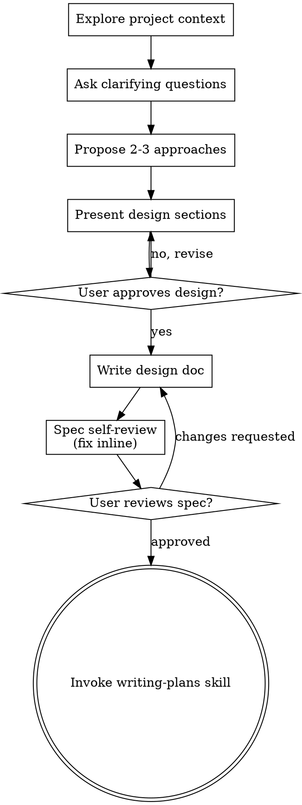

# Brainstorming Ideas Into Designs

Help turn ideas into fully formed designs and specs through natural collaborative dialogue.

Start by understanding the current project context, then ask questions one at a time to refine the idea. Once you understand what you're building, present the design and get user approval.

<HARD-GATE>
Do NOT invoke any implementation skill, write any code, scaffold any project, or take any implementation action until you have presented a design and the user has approved it. This applies to EVERY project regardless of perceived simplicity.
</HARD-GATE>

## Anti-Pattern: "This Is Too Simple To Need A Design"

Every project goes through this process. A todo list, a single-function utility, a config change — all of them. "Simple" projects are where unexamined assumptions cause the most wasted work. The design can be short (a few sentences for truly simple projects), but you MUST present it and get approval.

## Checklist

You MUST create a task for each of these items and complete them in order:

1. **Explore project context** — check files, docs, recent commits
2. **Offer the visual companion just-in-time** — NOT upfront. The first time a question would genuinely be clearer shown than described, offer it then (its own message); on approval its browser tab opens for you. If no visual question ever arises, never offer it. See the Visual Companion section below.
3. **Ask clarifying questions** — one at a time, understand purpose/constraints/success criteria
4. **Propose 2-3 approaches** — with trade-offs and your recommendation
5. **Present design** — in sections scaled to their complexity, get user approval after each section
6. **Write design doc** — save to `docs/superpowers/specs/YYYY-MM-DD-<topic>-design.md` and commit
7. **Spec self-review** — quick inline check for placeholders, contradictions, ambiguity, scope (see below)
8. **User reviews written spec** — ask user to review the spec file before proceeding
9. **Transition to implementation** — invoke digismith:writing-plans skill to create implementation plan

## Process Flow



**The terminal state is invoking digismith:writing-plans.** Do NOT invoke frontend-design, mcp-builder, or any other implementation skill. The ONLY skill you invoke after brainstorming is digismith:writing-plans.

## The Process

**Understanding the idea:**

- Check out the current project state first (files, docs, recent commits)
- Before asking detailed questions, assess scope: if the request describes multiple independent subsystems (e.g., "build a platform with chat, file storage, billing, and analytics"), flag this immediately. Don't spend questions refining details of a project that needs to be decomposed first.
- If the project is too large for a single spec, help the user decompose into sub-projects: what are the independent pieces, how do they relate, what order should they be built? Then brainstorm the first sub-project through the normal design flow. Each sub-project gets its own spec → plan → implementation cycle.
- For appropriately-scoped projects, ask questions one at a time to refine the idea
- Prefer multiple choice questions when possible, but open-ended is fine too
- Only one question per message - if a topic needs more exploration, break it into multiple questions
- Focus on understanding: purpose, constraints, success criteria

**Exploring approaches:**

- Propose 2-3 different approaches with trade-offs
- Present options conversationally with your recommendation and reasoning
- Lead with your recommended option and explain why
- YAGNI ruthlessly - remove unnecessary features from every approach and design

**Presenting the design:**

- Once you believe you understand what you're building, present the design
- Scale each section to its complexity: a few sentences if straightforward, up to 200-300 words if nuanced
- Ask after each section whether it looks right so far
- Cover: architecture, components, data flow, error handling, testing
- Be ready to go back and clarify if something doesn't make sense

**Design for isolation and clarity:**

- Break the system into smaller units that each have one clear purpose, communicate through well-defined interfaces, and can be understood and tested independently
- For each unit, you should be able to answer: what does it do, how do you use it, and what does it depend on?
- Can someone understand what a unit does without reading its internals? Can you change the internals without breaking consumers? If not, the boundaries need work.
- Smaller, well-bounded units are also easier for you to work with - you reason better about code you can hold in context at once, and your edits are more reliable when files are focused. When a file grows large, that's often a signal that it's doing too much.

**Working in existing codebases:**

- Explore the current structure before proposing changes. Follow existing patterns.
- Where existing code has problems that affect the work (e.g., a file that's grown too large, unclear boundaries, tangled responsibilities), include targeted improvements as part of the design - the way a good developer improves code they're working in.
- Don't propose unrelated refactoring. Stay focused on what serves the current goal.

## After the Design

**Documentation:**

- **DigiSmith-tracked work** (current working directory has `.claude-plugin/plugin.json` with
  `"name": "digismith"`, or `.digismith/profile` is present) — write the validated design to
  `.digismith/docs/<slug>/design.html` instead of this skill's own default location, using the
  exact HTML shell below (reuse the `<style>` block byte-for-byte, filling in `{{TITLE}}`,
  `{{DATE}}`, `{{MAP_ITEM}}`, and the body `<section>`s per the spec's own content):

  ```html
  <!doctype html>
  <html lang="en">
  <head>
  <meta charset="utf-8">
  <meta name="viewport" content="width=device-width, initial-scale=1">
  <title>{{TITLE}}</title>
  <style>
    :root {
      --bg: #ffffff; --fg: #1a1a1a; --muted: #5a5a5a; --border: #dcdcdc;
      --code-bg: #f4f4f4; --accent: #7a4fb5; --card-bg: #faf9fc;
    }
    @media (prefers-color-scheme: dark) {
      :root { --bg:#16151a; --fg:#e8e6ee; --muted:#a3a0ac; --border:#332f3d;
        --code-bg:#211f28; --accent:#b892ea; --card-bg:#1d1b23; }
    }
    * { box-sizing: border-box; }
    body {
      background: var(--bg); color: var(--fg);
      font-family: -apple-system, "Segoe UI", Helvetica, Arial, sans-serif;
      line-height: 1.6; max-width: 860px; margin: 0 auto; padding: 2.5rem 1.5rem 6rem;
    }
    header.doc-head { border-bottom: 1px solid var(--border); padding-bottom: 1.25rem; margin-bottom: 2rem; }
    h1 { font-size: 1.7rem; margin: 0 0 .4rem; }
    .meta { color: var(--muted); font-size: .9rem; }
    .meta span { margin-right: 1.2rem; }
    .badge {
      display: inline-block; border: 1px solid var(--accent); color: var(--accent);
      border-radius: 999px; padding: .1rem .6rem; font-size: .78rem; font-weight: 600;
    }
    nav.toc { background: var(--card-bg); border: 1px solid var(--border); border-radius: 10px;
      padding: 1rem 1.4rem; margin: 1.5rem 0 2.5rem; font-size: .92rem; }
    nav.toc h2 { font-size: .82rem; text-transform: uppercase; letter-spacing: .05em;
      color: var(--muted); margin: 0 0 .6rem; }
    nav.toc ol { margin: 0; padding-left: 1.2rem; columns: 2; }
    nav.toc a { color: var(--fg); text-decoration: none; }
    nav.toc a:hover { color: var(--accent); }
    section { margin-bottom: 2.6rem; }
    h2 { font-size: 1.25rem; border-bottom: 1px solid var(--border); padding-bottom: .35rem; }
    h3 { font-size: 1.05rem; color: var(--accent); margin-top: 1.6rem; }
    code { background: var(--code-bg); padding: .1rem .35rem; border-radius: 4px; font-size: .88em; }
    pre { background: var(--code-bg); border: 1px solid var(--border); border-radius: 8px;
      padding: 1rem; overflow-x: auto; }
    pre code { background: none; padding: 0; }
    ul, ol { padding-left: 1.4rem; }
    li { margin-bottom: .3rem; }
    .cards { display: grid; grid-template-columns: repeat(2, 1fr); gap: .9rem; margin: 1.2rem 0; }
    @media (max-width: 700px) { .cards { grid-template-columns: 1fr; } nav.toc ol { columns: 1; } table { font-size: .82rem; } }
    .card { border: 1px solid var(--border); background: var(--card-bg); border-radius: 10px; padding: 1rem 1.2rem; }
    .card h4 { margin: 0 0 .3rem; font-size: .98rem; }
    .card .tag { font-size: .74rem; color: var(--accent); text-transform: uppercase; letter-spacing: .04em; }
    .card p { margin: .4rem 0 0; font-size: .9rem; color: var(--muted); }
    table { border-collapse: collapse; width: 100%; font-size: .9rem; margin: 1rem 0; }
    .table-wrap { overflow-x: auto; }
    th, td { border: 1px solid var(--border); padding: .5rem .7rem; text-align: left; vertical-align: top; }
    th { background: var(--card-bg); }
    .callout { border-left: 3px solid var(--accent); background: var(--card-bg);
      padding: .8rem 1.1rem; border-radius: 0 8px 8px 0; font-size: .92rem; }
    footer { color: var(--muted); font-size: .82rem; border-top: 1px solid var(--border);
      padding-top: 1rem; margin-top: 3rem; }
  </style>
  </head>
  <body>

  <header class="doc-head">
    <span class="badge">approved for planning</span>
    <h1>{{TITLE}}</h1>
    <div class="meta">
      <span>Date: {{DATE}}</span>
      <span>Map item: {{MAP_ITEM}}</span>
    </div>
  </header>

  <nav class="toc">
    <h2>Contents</h2>
    <ol>
      {{TOC_ITEMS}}
    </ol>
  </nav>

  {{BODY_SECTIONS}}

  <footer>DigiSmith · .digismith/docs/<slug>/design.html</footer>

  </body>
  </html>
  ```

  `{{MAP_ITEM}}` is "no map letter — `<one-line reason>`" for a structural change with no map
  letter, same as `unified-docs-convention/design.html` already does — never leave it blank or
  invent a letter.

  **Slug:** reuse whatever slug the caller already resolved and passed into this invocation
  (e.g. `digismith:bootstrap` derives one before calling this skill, and passes it along) —
  never re-derive independently when one was already given. No slug was passed (a
  fully ad-hoc call — DigiSmith's own self-development or any other untracked-by-a-ticket case,
  no `digismith:bootstrap` in the loop) → derive it yourself: lowercase the feature description,
  drop filler words (a, an, the, on, to, of, for, in), replace remaining non-alphanumeric runs
  with a single hyphen, truncate to ~40 characters at a word boundary.

  **Before committing**, check whether the target path is gitignored in this repo:
  `git check-ignore -q .digismith/docs/<slug>/design.html` — exit 0 (ignored) → write the file,
  skip `git add`/commit, never force with `-f`; exit 1 (not ignored, the normal case for
  DigiSmith's own repo) → commit normally.

  **Publish the design doc.** If this invocation came from `digismith:bootstrap` or
  `digismith:adopt`, skip this publish step — they already handle it after this skill reports
  completion. Otherwise (a fully ad-hoc invocation), publish here directly: once the design doc
  is written (and committed, if not gitignored per the check above), read the active profile the
  same way `digismith:bootstrap` resolves one, and unless it has `publish_artifact: false`, call
  the `Artifact` tool on the written `design.html` — `title` from the doc's own `<title>` tag,
  `description` one sentence summarizing the feature, `favicon` one or two emoji fitting the
  topic (pick contextually, never reuse a generic default across unrelated features).
  `publish_artifact: false` → skip the `Artifact` call, state plainly why.

- **Not DigiSmith-tracked work** — write the validated design (spec) to
  `docs/superpowers/specs/YYYY-MM-DD-<topic>-design.md` (this skill's own unmodified default)
  - (User preferences for spec location override this default)
- Use elements-of-style:writing-clearly-and-concisely skill if available
- Commit the design document to git (unless the gitignore check above already determined this
  repo's `.digismith/docs/` is gitignored, in which case it was already written but intentionally
  not committed)

**Spec Self-Review:**
After writing the spec document, look at it with fresh eyes:

1. **Placeholder scan:** Any "TBD", "TODO", incomplete sections, or vague requirements? Fix them.
2. **Internal consistency:** Do any sections contradict each other? Does the architecture match the feature descriptions?
3. **Scope check:** Is this focused enough for a single implementation plan, or does it need decomposition?
4. **Ambiguity check:** Could any requirement be interpreted two different ways? If so, pick one and make it explicit.

Fix any issues inline. No need to re-review — just fix and move on.

**User Review Gate:**
After the spec review loop passes, ask the user to review the written spec before proceeding:

> "Spec written and committed to `<path>`. Please review it and let me know if you want to make any changes before we start writing out the implementation plan."

Wait for the user's response. If they request changes, make them and re-run the spec review loop. Only proceed once the user approves.

**Implementation:**

- Invoke the digismith:writing-plans skill to create a detailed implementation plan
- Do NOT invoke any other skill. digismith:writing-plans is the next step.

## Visual Companion

A browser-based companion for showing mockups, diagrams, and visual options during brainstorming. Available as a tool — not a mode. Accepting the companion means it's available for questions that benefit from visual treatment; it does NOT mean every question goes through the browser.

**Offering the companion (just-in-time):** Do NOT offer it upfront. Wait until a question would genuinely be clearer shown than told — a real mockup / layout / diagram question, not merely a UI *topic*. The first time that happens, offer it then, as its own message:
> "This next part might be easier if I show you — I can put together mockups, diagrams, and comparisons in a browser tab as we go. It's still new and can be token-intensive. Want me to? I'll open it for you."

**This offer MUST be its own message.** Only the offer — no clarifying question, summary, or other content. Wait for the user's response. If they accept, start the server with `--open` so their browser opens to the first screen automatically. If they decline, continue text-only and don't offer again unless they raise it.

**Per-question decision:** Even after the user accepts, decide FOR EACH QUESTION whether to use the browser or the terminal. The test: **would the user understand this better by seeing it than reading it?**

- **Use the browser** for content that IS visual — mockups, wireframes, layout comparisons, architecture diagrams, side-by-side visual designs
- **Use the terminal** for content that is text — requirements questions, conceptual choices, tradeoff lists, A/B/C/D text options, scope decisions

A question about a UI topic is not automatically a visual question. "What does personality mean in this context?" is a conceptual question — use the terminal. "Which wizard layout works better?" is a visual question — use the browser.

If they agree to the companion, read the detailed guide before proceeding:
`skills/brainstorming/visual-companion.md`
